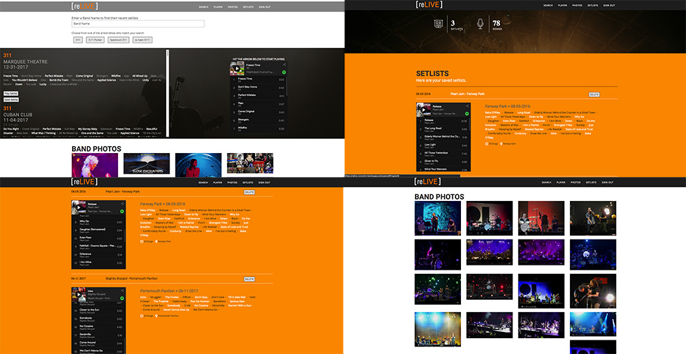

<h1>reLive - The Concert Experience</h1>
<p><a href="https://relive-concerts.herokuapp.com">reLive - The Concert Experience</a> is a responsive full-stack application that allows users to listen to concert setlists and see photos of their favorite musical artists.  By utilizing APIs from Last.fm, Setlist.fm, Flickr and Spotify, reLive allows users to relive their favorite concerts.</p>




## Getting started
### Installing
```
>   git clone https://github.com/Bushmb/reLive-The-Concert-Experience.git
>   cd relive-the-concert-experience
>   npm install
```
### Launching 

```
>   npm start
```

Then open [`localhost:8080`](http://localhost:8080) in a browser if a window is not automatically opened for you.


<h2>Introduction</h2>
<p>reLive was built out of my love for music and concerts. reLive allows you to see what songs your favorite musical artists are playing at their concerts and listen to the setlist long after the show. My most ambitious project to date, reLive uses 4 different APIs to get concert data, photos of the musician, and setlists which you can then listen to and save to your spotify account.</p>

<h2>How it Works</h2>
<h3>Search for a musical Artist</h3>
<p>Choose a musical artist, any musical artist.  Once you type it into the search bar, reLive uses Last.Fm to pull up the most relevent artists related to your search with the most likely artist listed first.  By clicking one of the artists buttons below the search, reLive uses Setlist.fm to find the most recent concerts played by that musician</p>

<h3>Choosing a concert</h3>
<p>Below the search field, reLive presents a list of the most recent concerts played by the band of musical artist you have selected.  You are given the option to play or save the setlist.  By choosing the play setlist button, a spotify widget is loaded with as many of the songs as could be found using Spotify's API.  Not every artist is on Spotify, nor is every song.  If songs are not loaded into the playlist, it may mean the name is incorrrect, or the song being played is a cover of another song.</p>

<h3>Saving Setlists</h3>
<p>reLive gives you the ability to save your favorite setlists from your favorite concerts. If you use your Spotify account to login, you enable reLive to save the playlists on the app.  This is only possible by utilizing the Spotify API which provides the ability to store these playlists on your Spotify account.</p>

<h2>Technology</h2>
<h3>Front End</h3>
<ul>
  <li>HTML5</li>
  <li>CSS3</li>
  <li>JavaScript</li>
  <li>jQuery</li>
</ul>
<h3>Back End</h3>
<ul>
  <li>Node.js + Express.js (web server)</li>
  <li>MongoDB (database)</li>
  <li>Passport<li>
</ul>

<h3>Responsive</h3>
<ul>
  <li>The app is fully responsive and quickly adapts to all mobile, tablet, and desktop viewports.</li>
</ul>
<h3>Security</h3>
<ul>
  <li>reLive uses a full authorization flow using OAuth 2.0 and Passport to enable users to login through their Spotify account, which means they can save and view the setlists played by their favorite musicians.</li>
</ul>